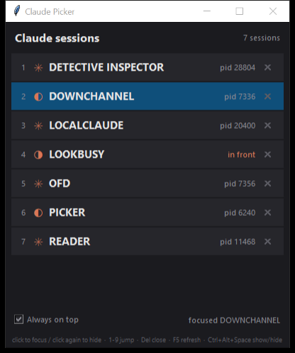

# claudepicker

A small always-on-top window listing every running Claude Code / PowerShell
session on Windows, so you can jump between them without hunting the taskbar.

Claude Code sets its console window title to the session name with a status glyph
in front of it (`* DOWNCHANNEL`, `(-) PICKER`), so the picker can show the session
name and whether Claude is busy.

## What it does

- Lists every visible `powershell.exe` / `pwsh.exe` window, refreshed every 1.5s
  in place (no flicker while the spinner glyph animates). The foreground session
  is marked `in front`.
- **Click a row** to bring that session forward; **click it again** to send it back
  to the taskbar.
- **Ctrl+Alt+Space** summons the picker from anywhere, and hides it again when it
  already has focus.
- **`X` on a row** (or `Del`) closes a session, gracefully: `Ctrl+U` then `/exit`
  typed into it, falling back to `WM_CLOSE` after ~6s, and only offering a hard
  terminate once it has refused to die for ~13s. Every close asks first.
- Keyboard: `1`-`9` jump to a session, arrows + `Enter`, `F5` refresh, `Esc` hide.

## Running it

Requires Windows and Python 3 (stdlib only - no dependencies).

    pythonw claudepicker.py

or double-click `picker.bat`. Run it with `pythonw`, not `python`: the app has to
be free of a console of its own to borrow a session's console when typing `/exit`.

To start it at logon, register a scheduled task:

    $action = New-ScheduledTaskAction -Execute "C:\Python313\pythonw.exe" `
        -Argument '"C:\path\to\claudepicker.py"'
    $trigger = New-ScheduledTaskTrigger -AtLogOn -User "$env:USERDOMAIN\$env:USERNAME"
    $trigger.Delay = "PT20S"
    Register-ScheduledTask -TaskName claudepicker -Action $action -Trigger $trigger

## Layout

| file | what |
|------|------|
| `claudepicker.py` | the tkinter window: rows, keyboard, close state machine |
| `winsessions.py` | the Win32 layer: enumerate, focus, minimize, console input, close, hotkey |
| `picker.bat` | launcher |

`python winsessions.py` prints the sessions it can see, which is the quickest way
to check the enumeration on a new machine.

## Notes

- Closing a *busy* session queues `/exit` in its prompt box, so the `WM_CLOSE`
  fallback is what actually ends it. `Ctrl+U` is used instead of `Escape` for
  clearing the prompt because `Escape` would interrupt a response in flight.
- Crashes are written to `error.txt` beside the script, since `pythonw` has
  nowhere to print them.
